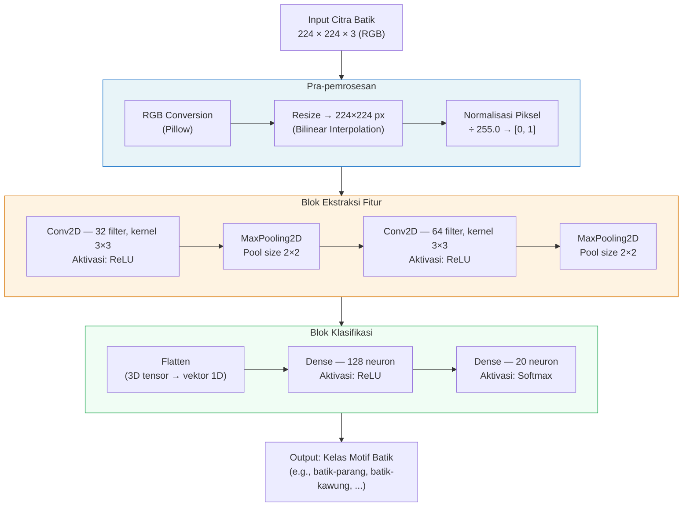

## 1. Arsitektur Model CNN

Diagram ini menggambarkan susunan layer-by-layer dari model CNN baseline yang sudah diimplementasikan.

**Penjelasan alur:** Input citra mentah masuk ke tahap pra-pemrosesan (konversi RGB → resize → normalisasi). Hasilnya tensor 224×224×3 mengalir ke dua blok konvolusi yang mengekstrak fitur low-level hingga mid-level (tepi, tekstur, pola). Setelah di-flatten, Dense layer memetakan fitur ke 20 kelas motif via Softmax.

---

## 2. Block Diagram Sistem End-to-End

Diagram ini menggambarkan alur sistem secara keseluruhan, dari sumber data sampai output prediksi.

```mermaid
flowchart LR
    subgraph SRC["Sumber Data"]
        A1["Dataset Kaggle\nIndonesian Batik Motifs\n983 citra / 20 kelas"]
    end

    subgraph PRE["Pra-pemrosesan & EDA"]
        B1["EDA\n(distribusi kelas, dimensi)"]
        B2["Image Preprocessing\n(RGB, resize 224×224, normalisasi)"]
        B3["Label Encoding\n(LabelEncoder scikit-learn)"]
    end

    subgraph SPLIT["Pembagian Data"]
        C1["Train Set\n70% → 686 gambar"]
        C2["Validation Set\n15% → 147 gambar"]
        C3["Test Set\n15% → 148 gambar"]
    end

    subgraph AUG["Augmentasi Data"]
        D1["ImageDataGenerator\n(rotasi ±20°, flip H,\nshift 10%, zoom 10%)"]
        D2["Hanya pada Train Set"]
    end

    subgraph MODEL["Model CNN (Keras Sequential)"]
        E1["Feature Extraction\n2× (Conv2D + MaxPool)"]
        E2["Classification Head\nFlatten → Dense(128) → Dense(20)"]
        E3["Compile\nAdam | Sparse Categorical Crossentropy"]
    end

    subgraph TRAIN["Pelatihan"]
        F1["Training Loop\nmax 50 epoch, batch 32"]
        F2["EarlyStopping\npatience=5 pada val_loss"]
        F3["Best Weights Restore\n(epoch terbaik disimpan)"]
    end

    subgraph EVAL["Evaluasi (Planned)"]
        G1["Metrik\n(accuracy, loss, F1)"]
        G2["Confusion Matrix"]
        G3["Error Analysis"]
    end

    H1["Prediksi Kelas Motif"]

    SRC --> PRE
    B1 --> B2 --> B3
    PRE --> SPLIT
    C1 --> AUG --> MODEL
    C2 --> MODEL
    SPLIT --> TRAIN
    MODEL --> TRAIN
    F1 --> F2 --> F3
    TRAIN --> EVAL
    C3 --> EVAL
    EVAL --> H1

    style SRC fill:#ede9fe,stroke:#7c3aed
    style PRE fill:#e8f4f8,stroke:#3182ce
    style SPLIT fill:#fef9c3,stroke:#ca8a04
    style AUG fill:#fff7ed,stroke:#ea580c
    style MODEL fill:#fef3e2,stroke:#d97706
    style TRAIN fill:#f0fdf4,stroke:#16a34a
    style EVAL fill:#fdf2f8,stroke:#db2777
```

**Penjelasan alur:** Dataset diunduh dari Kaggle lalu melewati EDA dan preprocessing. Data dibagi secara stratified 70/15/15. Augmentasi hanya diterapkan ke train set agar evaluasi tetap realistis. Model dilatih dengan mekanisme EarlyStopping, lalu dievaluasi pada test set yang belum pernah dilihat model.

---

## 3. Flowchart Program (Training & Inference)

Diagram ini menggambarkan alur runtime program, dari inisialisasi hingga penyimpanan model.

```mermaid
flowchart TD
    START([Mulai])

    subgraph SETUP["1. Setup & Inisialisasi"]
        A["Install & import library\n(TF/Keras, Pillow, sklearn, dll)"]
        B["Download dataset via KaggleHub\nPath: /kaggle/input/indonesian-batik-motifs"]
    end

    subgraph EDA_BLOCK["2. Exploratory Data Analysis"]
        C["Hitung jumlah gambar per kelas"]
        D{"Dataset\nseimbang?"}
        E["Catat imbalance ratio\nStratified split direkomendasikan"]
        F["Lanjut preprocessing"]
    end

    subgraph PREPROC["3. Pra-pemrosesan Citra"]
        G["Baca file gambar\n(Pillow + EXIF correction)"]
        H{"Format\nbukan RGB?"}
        I["Konversi ke RGB 3-channel\n(RGBA / L / CMYK → RGB)"]
        J["Resize → 224×224 px\n(BILINEAR interpolation)"]
        K["Normalisasi piksel\n÷ 255.0 → range [0,1]"]
        L["Label Encoding\n(string → integer)"]
        M{"File\ngagal dibaca?"}
        N["Skip file\n(catat di failed_files)"]
    end

    subgraph DATASPLIT["4. Pembagian & Augmentasi"]
        O["Stratified Train/Val/Test Split\n70% / 15% / 15%"]
        P["ImageDataGenerator untuk Train\n(rotasi, flip, shift, zoom)"]
        Q["Val & Test: NO augmentasi\n(hanya rescale)"]
    end

    subgraph BUILD["5. Bangun Model CNN"]
        R["Sequential Model\n2 blok Conv2D + MaxPool"]
        S["Tambah Classification Head\nFlatten → Dense(128) → Dense(20, Softmax)"]
        T["Compile model\nOptimizer: Adam\nLoss: Sparse Categorical Crossentropy"]
    end

    subgraph TRAINING["6. Training Loop"]
        U["Inisialisasi EarlyStopping\nmonitor=val_loss, patience=5"]
        V["Jalankan model.fit()\nbatch_size=32, max epoch=50"]
        W{"val_loss tidak\nturun ≥5 epoch?"}
        X["Restore best weights\n(epoch dengan val_loss terendah)"]
        Y["Lanjut epoch berikutnya"]
    end

    subgraph EVALBLOCK["7. Evaluasi & Simpan"]
        Z["Evaluasi pada Test Set\n(accuracy, loss)"]
        AA["Generate Confusion Matrix\n& Classification Report"]
        AB["Simpan model (.h5 / SavedModel)"]
        AC["Analisis error & visualisasi"]
    end

    END([Selesai])

    START --> SETUP
    A --> B --> EDA_BLOCK
    C --> D
    D -->|"Ya"| F
    D -->|"Tidak"| E --> F
    F --> PREPROC
    G --> H
    H -->|"Ya"| I --> J
    H -->|"Tidak"| J
    J --> K --> M
    M -->|"Ya"| N --> G
    M -->|"Tidak"| L
    L --> DATASPLIT
    O --> P
    O --> Q
    DATASPLIT --> BUILD
    R --> S --> T
    BUILD --> TRAINING
    U --> V --> W
    W -->|"Ya"| X --> EVALBLOCK
    W -->|"Tidak"| Y --> V
    Z --> AA --> AB --> AC --> END
```

**Penjelasan alur:** Program dimulai dengan setup environment dan unduh dataset. EDA memeriksa distribusi kelas sebelum preprocessing berjalan per-gambar (dengan penanganan file gagal). Data dibagi secara stratified, augmentasi hanya pada train set. Model dibangun dan dilatih dengan loop yang berhenti otomatis saat validasi stagnan, lalu bobot terbaik di-restore untuk evaluasi final.
